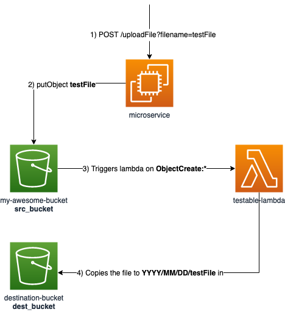

# localstack-microservices-integration

This service uploads a file to S3. 

This is the main service of a distributed architecture in which for each upload to S3, a lambda should be triggered. 

## Provisioning 

Provisioning service is included for offline-testing purposes. Its duties are:

1- create a bucket
2- fetch the ARN of the lambda
3- create the notification configuration of the bucket

The reason is to encapsulate all this logic outside the service as it does not belong there. 

## Example

```sh
# run the service
> make run

# provisioning
> curl -X PUT localhost:1338/provision
{"provision":"DONE"}

> curl -X POST localhost:1337/uploadFile?filename=blahonga
{"message":"success"}
# at this point the lambda has been triggered

> aws --endpoint-url=http://localhost:4566 s3 ls s3://my-awesome-bucket/
2021-06-16 23:15:58         55 blahonga
```
## Flow

