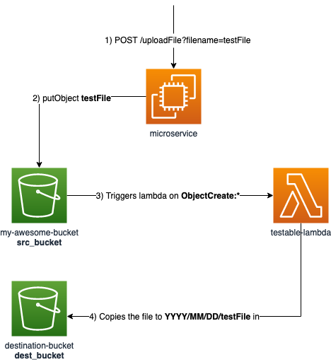

# localstack-microservices-integration

This service uploads a file to S3. 

This is the main service of a distributed architecture in which for each upload to S3, a lambda should be triggered. 

## Provisioning 

Provisioning service is included for offline-testing purposes. Its duties are:

1. to create a bucket
2. to fetch the ARN of the lambda
3. to create the notification configuration of the bucket

The reason is to encapsulate all this logic outside the service as it does not belong there. 

## Example

```sh
# run the service
> make run

# provisioning
> curl -X PUT localhost:1338/provision
{"provision":"DONE"}

> curl -X POST localhost:1337/uploadFile?filename=blahonga
{"message":"success"}
# at this point the lambda has been triggered

> aws --endpoint-url=http://localhost:4566 s3 ls s3://my-awesome-bucket/
2021-06-16 23:15:58         55 blahonga
```

## Dependencies

### Lambda 

Repo: https://github.com/wuiscmc/e2e-testable-lambda

Once cloned, build the image
```bash
> make docker-build
``` 

## FAQ

### I cannot access S3 from the main service, it complains about the S3 service not being available in my region
Make sure you are setting the `AWS_REGION` environment variable, for each container with access to AWS resources, to the same region (i.e. `eu-west-1`).

### The lambda does not get triggered despite having registered the notification from S3
Very likely because the lambda has not been created in the same region. Set the `DEFAULT_REGION` env var from localstack and point it to the same region as `AWS_REGION`.

### The lambda gets triggered but it gets stuck and times out 
By default, localstack spins up the lambdas in separate docker containers and that they can not access any resources from the network the rest of the services are runnning in. This means that the lambdas by default do not have access to localstack, so to easily address this issue set the `LAMBDA_DOCKER_NETWORK` to point the default network created by docker-compose, usually this is `<repo>_default` but you can check this out by using ```docker network ls```

## Flow


